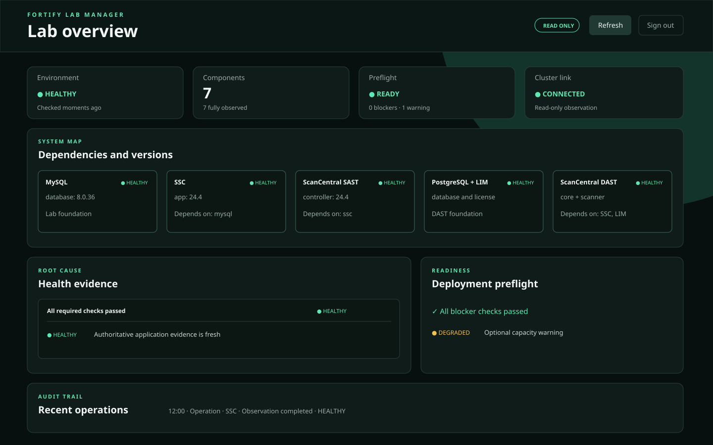
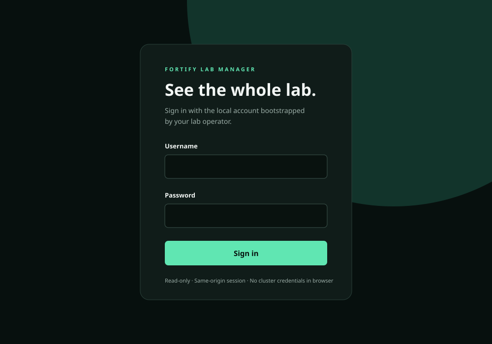

# Authenticated Web dashboard

The Fortify Lab Manager dashboard presents the complete single-node MicroK8s
lab on one same-origin browser page. It shows the desired component graph and
versions, current dependency-aware health evidence, primary root cause and
safe remediation, latest deployment preflight, cluster-observation state, and
recent sanitized manager operations and controlled typed lifecycle actions.
ASPM remains outside project scope.

Lifecycle plans label every step with its recovery class and show the strongest
plan recovery boundary before confirmation. Failure detail retains the
sanitized operation evidence and next action; see
[Rollback and recovery boundaries](operations/rollback-recovery.md).

## Access and authentication

The dashboard follows [ADR 0009](adr/0009-manager-runtime-boundary.md).
Supported remote lab access is only through MicroK8s nginx ingress at
`https://lab.$DOMAIN`; the host backend listener is not a browser-facing
route. See the [manager operator guide](operations/manager.md). This lab UI is
not designed for public Internet exposure.

An operator must bootstrap the local account outside the browser and pass
only its PBKDF2 password verifier to `DashboardApp`. The helper
`manager.dashboard.password_verifier()` creates that verifier; do not put the
plaintext password in source, command history, environment dumps, or a
committed configuration file. A production launcher must store account
verifiers in manager-owned state with mode `0600`.

The login creates a random server-side session. Cookies are `HttpOnly` and
`SameSite=Strict`, have bounded idle and absolute lifetimes, and must be
configured with `secure_cookies=True` behind TLS. Only the coarse `/ready`
response is unauthenticated. Static assets contain no lab data; all
`/api/v1alpha1/*` reads and mutations require the session. Cross-origin API access is
not enabled and browser responses carry a restrictive Content Security
Policy.

## Dashboard states

The page does not convert missing evidence into success:

- components, health, preflight, recent history, effective Manager capabilities,
  and lifecycle operations each
  own a live state region. A `503` or adapter failure in one read model leaves
  successful panels visible; previously successful evidence in the failed
  panel is retained and explicitly labelled stale;
- `healthy`, `starting`, `degraded`, `blocked`, `misconfigured`, `stopped`,
  `unreachable`, and `unknown` are separately labelled and colored; the
  current health contract also preserves `unhealthy` and `stale`;
- a disconnected cluster keeps desired inventory and versions visible while
  observed resources become unknown and disables lifecycle planning until
  safe observation recovers;
- the versioned capability document, rather than component connectivity,
  controls the header operation badge, plan form, execution, confirmation,
  cancellation, and retry controls. Unknown, newer, expired, malformed, or
  unavailable capability evidence fails closed while inspection remains
  available;
- loading, empty, stale, unavailable, unauthorized, and other API errors have
  distinct text and a safe next action;
- downstream failures retain `blockedBy` and `rootCause`, so the page
  emphasizes the primary problem instead of repeating symptoms;
- remediation links point only to repository health and preflight guides.

The summary identifies the connected node and Kubernetes version, observer
connectivity, observed component count, degraded count, primary root-cause
identifiers, blocked consumers, preflight blockers, last successful refresh,
and evidence age. When the API supplies no node, version, timestamp, or age,
the page says that the field was not reported rather than presenting an
ambiguous `unknown`.

Every panel settles as soon as its own request finishes; it does not wait for
the other read models. Each read has an eight-second browser deadline and is
cancelled with `AbortController` when it expires or the page becomes hidden.
Loading is therefore terminal within eight seconds plus local rendering time.
A panel reports both the evidence observation time (when its contract supplies
one) and the browser refresh time. Missing observation time is labelled
`not reported`, never inferred from another panel. The header count is derived
from the same panel registry that starts the reads.

## Component explorer and inspector

The component explorer shows all seven registered MicroK8s components in a
wrapping grid without horizontal page scrolling. Search matches safe component,
workload, chart, image, and product-version metadata. Health and observed-state
filters can be combined with update and active-operation filters. Because the
current observer does not report running image versions, **Updates** fails
closed to an empty result instead of inferring drift from desired versions.

Select a card with pointer input or keyboard activation to open the right-side
component inspector. The selected card has a visible and screen-reader-exposed
pressed state. While the inspector is open, upstream dependency cards and
unhealthy or blocked downstream consumer cards are emphasized. Native modal
dialog behavior traps focus and closes on **Escape**; closing restores focus to
the selected card. On displays up to 520 pixels wide the inspector fills the
viewport. Reduced-motion preferences suppress its entrance movement.

The current selection is represented as `?component=ssc`. A valid deep link
opens after inventory arrives. Unknown component IDs are ignored and never
interpolated into DOM markup or selectors. Removing or closing the inspector
removes the query parameter without reloading the page.

The inspector remains usable when live observation is disconnected, stale,
unauthorized after earlier successful evidence, partial, or unknown. It labels
desired configuration separately from observed state and presents overview,
health/root cause, dependencies and consumers, workloads, profile and product
version, chart and image versions, declared HTTPS endpoint identifiers,
storage purpose/retention, supported typed operations, and recent sanitized
history.

Color is never the only health cue: every badge includes visible state text.
The page provides landmarks, a skip link, labelled controls, table headers,
alert/status live regions, keyboard focus styles, responsive layouts, and
reduced-motion handling.

## Controlled operations

Before interaction, the browser reads
[`GET /api/v1alpha1/capabilities`](manager-capabilities.md). The
`lifecycle-execution` entry is authoritative for both the header badge and
operation panel. `disabled`, `not-configured`, `unauthorized`, `degraded`, and
`temporarily-unavailable` states explain why an action cannot succeed before
submission and link to safe operator guidance. Component inventory never
enables mutation controls.

Select an action and components, then choose **Review plan**. The manager
shows the registry-resolved ordered steps, dependency additions, bounded
timeouts, verification count, risk, and destructive/data-deletion
classification. Requests contain only operation and component identifiers,
never commands, paths, adapter names, environment values, or secrets.

Routine supported actions can start after review. Disruptive actions require
a single-use approval bound to the actor, browser session, exact plan, current
target state, and expiry. High-risk actions additionally require
`AUTHORIZE HIGH-RISK OPERATION` and a recently authenticated session.
Uninstall and persistent-data deletion remain separate plan types; uninstall
never implicitly deletes persistent data.

The progress panel renders durable state, completed and total steps, sanitized
events, cancellation, retry eligibility, and completion health. The active
opaque operation ID is retained in browser session storage. Refresh or a
same-session reconnect retrieves authoritative state from
`GET /api/v1alpha1/operations/{id}`; leaving the page does not cancel work.
Cancellation is cooperative and can remain `cancelling` until the adapter
reaches a cancellation boundary. Retry creates a new operation and does not
reuse an approval.

`DashboardApp` returns `503 OPERATIONS_UNAVAILABLE` unless composition
supplies the shared engine, authorization service, current-state provider,
and an independently validated namespace-scoped adapter. The capability
contract reports this as `not-configured` before interaction.

## Disclosure boundary

The browser receives the safe projections already defined by the inventory,
health, preflight, and record contracts. It never receives Kubernetes
credentials, Secrets, logs, filesystem paths, adapter targets, licenses,
tokens, passwords, private keys, authorization headers, or cookies through
JSON. History is projected to stable identity, kind, state, summary, subject,
and time after persistence-layer sanitization.

The inventory inspector projection adds only allowlisted registry metadata:
profile identity/maturity/product version; workload identity, kind, role, and
scalability; operation identity and safety flags; storage purpose and retention;
and declared HTTPS health endpoint identifiers. It excludes operation adapter
paths, raw Helm values and manifests, environment variables, Secret names and
contents, persistence claim names, diagnostic targets, registry credentials,
tokens, license contents, private keys, and protected filesystem paths.

The UI uses DOM `textContent`, not HTML interpolation, for API data. A
read-path compromise therefore cannot use the supported API to retrieve
submitted secret values. Secret status remains metadata-only under
[ADR 0005](adr/0005-write-only-secrets.md).

## Failure recovery

Use **Refresh** after a transient manager or adapter failure. Refresh and
auto-refresh share one generation and never overlap. Auto-refresh is enabled
by default at a bounded 30-second interval and pauses while the page is
hidden; hiding the page also cancels unfinished reads. It can be disabled from the
keyboard-accessible header control. A successful retry replaces stale panel
evidence without reloading the page.
Capability evidence refreshes on the same bounded cycle and does not require
re-login. Its 45-second expiry is longer than the normal 30-second refresh
interval; controls disable immediately if the document nevertheless expires.

Only `401` or `403` responses show the session-expired action and pause
refreshes; a `503`, network interruption, or disconnected observer does not
send the operator to sign-in. Error detail is restricted to a normalized
status such as `REGISTRY_UNAVAILABLE`, `OBSERVER_DISCONNECTED`, or
`AUTHENTICATION_REQUIRED`; response bodies, adapter exceptions, logs, paths,
and protected values are not rendered.

Failed,
timed-out, and manager-interrupted operations offer **Retry** after the
operator reviews sanitized events and current health. If the session
expires, the next API request returns `401` and the page presents a sign-in
link while leaving prior evidence visible and marked stale or unauthorized.
If only cluster observation is unavailable, investigate the manager's
allow-listed observer; do not broaden RBAC or grant access to Secrets. Health
and preflight remediation remain in
[health-checks.md](health-checks.md) and
[deployment-preflight.md](deployment-preflight.md).

Browser contract tests in `tests/test_dashboard.py` and operation transport
tests in `tests/test_web_operations.py` cover authentication, expiry, logout,
method rejection, headers, disclosure, API history, accessibility structure,
independent loading/empty/stale/unavailable/unauthorized/error presentations,
partial `503`, disconnected adapter, recovery, empty cluster, current
live-cluster failure projection, plans, dependency blocks,
approval, timeout, cancellation, retry, reconnect, completion health, and
sanitized failures. They are static and in-process tests: no live MicroK8s
validation was performed.
